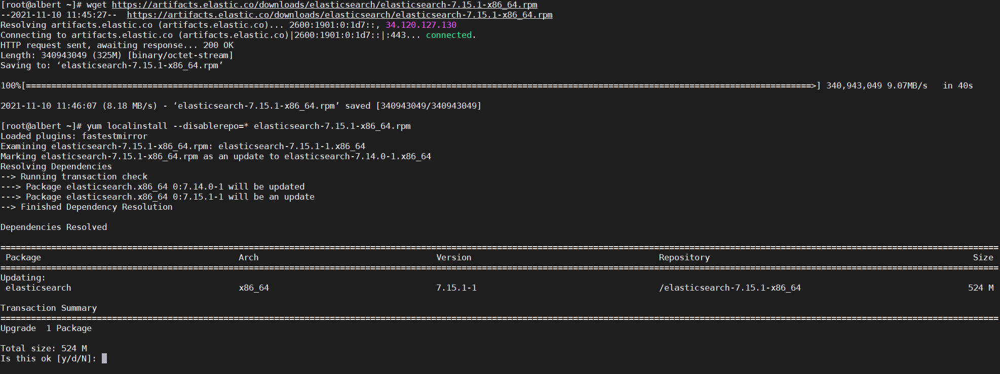

**Table of Contents**


# Requirement and additional packages

  1. Recommended OS: Instal l Rocky Linux 9.2 x86_64
  2. Install additional Packages
<br>`yum install -y tar pinentry net-snmp net-snmp-utils net-tools telnet openssh openssh-clients ftp expect wget traceroute unzip zip vim openssl`

# Installation of ElasticSearch
## Step 1. Install and Configure JVM
  - Install Elasticsearch:

    `wget https://artifacts.elastic.co/downloads/elasticsearch/elasticsearch-8.11.4-x86_64.rpm --no-check-certificate`

    `yum localinstall --disablerepo=* elasticsearch-8.11.4-x86_64.rpm`

    


  - Authentication is auto-enabled in new ElasticSearch v8.x.x and take note of the generated random password (underlined) during installation:
    - Authentication and authorization are enabled.
    
      TLS for the transport and HTTP layers is enabled and configured.

      <u>The generated password for the elastic built-in superuser is : t_uYH54WkAddVJ8qAK9s</u>

      If this node should join an existing cluster, you can reconfigure this with
      '/usr/share/elasticsearch/bin/elasticsearch-reconfigure-node --enrollment-token <token-here>'
      after creating an enrollment token on your existing cluster.

      You can complete the following actions at any time:

      Reset the password of the elastic built-in superuser with
      <br>'/usr/share/elasticsearch/bin/elasticsearch-reset-password -u elastic'.

      Generate an enrollment token for Kibana instances with
      <br>'/usr/share/elasticsearch/bin/elasticsearch-create-enrollment-token -s kibana'.

      Generate an enrollment token for Elasticsearch nodes with
      <br>'/usr/share/elasticsearch/bin/elasticsearch-create-enrollment-token -s node'.

      ---
      \### NOT starting on installation, please execute the following statements to configure elasticsearch service to start automatically using systemd
      <br>sudo systemctl daemon-reload
      <br>sudo systemctl enable elasticsearch.service
      <br>\### You can start elasticsearch service by executing
      <br>sudo systemctl start elasticsearch.service

  - Edit the jvm.options to change the heap size:

    `vi /etc/elasticsearch/jvm.options`

    - Change below for min and max heap size, for below the physical RAM of the server is 3GB:

    - Please note that the heap size cannot exceed the 50% of total RAM you have in server.

    - if your server is 16GB, likely this min and max heap size can be set as 4GB

      -Xms4g ## 1Gb is the minimum heap size

      -Xmx4g ## 1Gb is the maximum heap size

## Step 2. Configure elasticsearch
  - Edit the configuration file of elasticsearch

    `vi /etc/elasticsearch/elasticsearch.yml`

  - Input below parameter
  <pre><code>    <u><b>cluster.name: netgainelkdb</b></u> # this is to define a cluster name
    <u><b>node.name: netgainnode-1</b></u> #this is to define a node name
    <u><b>network.host: 127.0.0.1</b></u> #this is the IP address that the localhost or other server going to contact with elasticsearch.
    <u><b>discovery.type: single-node</b></u>

    # Enable security features
    xpack.security.enabled: true

    <u><b>xpack.security.enrollment.enabled: false</b></u>

    # Enable encryption for HTTP API client connections, such as Kibana, Logstash, and Agents
    xpack.security.http.ssl:
      <u><b>enabled: false</b></u>
      keystore.path: certs/http.p12

    # Enable encryption and mutual authentication between cluster nodes
    
    xpack.security.transport.ssl:
      <u><b>enabled: false</b></u>
      verification_mode: certificate
      keystore.path: certs/transport.p12
      truststore.path: certs/transport.p12
    # Create a new cluster with the current node only
    # Additional nodes can still join the cluster later
    <u><b>#cluster.initial_master_nodes: ["localhost"]</b></u>

    # Allow HTTP API connections from anywhere
    # Connections are encrypted and require user authentication
    http.host: 0.0.0.0

    # Allow other nodes to join the cluster from anywhere
    # Connections are encrypted and mutually authenticated
    #transport.host: 0.0.0.0
</code></pre>
** **change the details of the underlined bold using the above settings**


## Step 3. Start and enable elasticsearch service on boot

  - start and enable service on boot

    `systemctl enable --now elasticsearch.service`

  - verify status

    `systemctl status elasticsearch.service -l`

    

  - Verify security password

    `curl http://127.0.0.1:9200 -u elastic`

    whereas it will ask for the generated built-in password

    


  - Optional to manually change the ES password:
  
    `cd /usr/share/elasticsearch`

    `./bin/elasticsearch-reset-password -u elastic -i`

# Installation of NetGain EM
## 1. Download v12 Base software

Download link: https://drive.google.com/file/d/16CX1TXhzT7kUhrjhfZyaMrKfmmKVdicX/view?usp=sharing 

winscp to your appliance and copy the download base v12 software to root directory 

`tar -xzvf netgainBASE_v12.2.148.tar.gz --absolute-names`

Note: please use above exact command, otherwise the license will have issues that causes process not able to start.

## 2. Updated Java and Tomcat

`export PATH=/root/netgain/jre/bin:$PATH`

```
Java version "1.8.0_311"
Java(TM) SE Runtime Environment (build 1.8.0_311-b11)
Java HotSpot(TM) 64-Bit Server VM (build 25.311-b11, mixed mode)

Tomcat version: v9.0.73
```

## 3. Disable firewall 

`service firewalld stop`

## 4. Configure rc.local (bold fonts > change it accordingly for customer)

`vi /etc/rc.local`

```
touch /var/lock/subsys/local
systemctl stop firewalld
export NG_LICENSE_BY_MACADDR=1
export IOSS_HOME=/root/netgain
export NETGAIN_SERIAL=NGSG2209001
export EM_MODEL=EM-BASE
export EM_CUSTOMER_NAME=Customer_name
su - root -c "$IOSS_HOME/bin/agent_start.sh"
systemctl start elasticsearch.service
su - root -c "$IOSS_HOME/bin/box.sh"
```

example:

**NGSG2209001** should be change to your own serial key

whereas:

NG – NetGain (partner/customer name)
SG – Singapore (country)
22 – 2022 (year)
09 – Sept (month)
001 – running number

**EM-BASE-Demo**

whereas:

Demo - base model of the license


## 5. Give full permission for rc.local

`chmod +x /etc/rc.d/rc.local`

`systemctl enable rc-local`

`systemctl start rc-local`

## 6. Configure vi /etc/sysconfig/i18n for english language during bootup process

`vi /etc/sysconfig/i18n`

```
LANG="en_US.UTF-8"  
SYSFONT="latarcyrheb-sun16"  
SUPPORTED="en_US.UTF-8:en_US:en"
```

## 7. Change NetGain application configuration

`vi /etc/ng.conf`

```
export SKIP_WDT=1  
export CHARSET=en_US
export MAX_MEM=1000 #change 50 - 70% of your VM total RAM
export NG_LICENSE_BY_MACADDR=1
JAVA_OPTS="${JAVA_OPTS} -Delk=1"
JAVA_OPTS="${JAVA_OPTS} -Delasticsearch_ip=127.0.0.1"
```

## 8. Setup Date and Time 

`hwclock --set --date='12/22/2014 14:35'`

`date -s "22 December 2014 14:35"`

`yum install chrony`

`timedatectl set-ntp yes`

`service chronyd start`

(*NTP is another option for auto date and time:  ntpdate pool.ntp.org)


## 9. Check DNS record

`vi /etc/resolv.conf`

```
nameserver 8.8.8.8
```

customer DNS should be put after nameserver

## 10. Add EM process check to cronjob

`crontab -e`

```
#* * * * * /root/netgain/bin/check_box.sh
#*/15 * * * * /root/netgain/bin/ha/standby.sh
10 0 * * * mon sync; echo 3 > /proc/sys/vm/drop_caches
0 6 * * * find /var/log/iossd* -mtime +30 -delete
```

Note: this command is to check if NetGain is inaccessible and it will auto restart the service (remember to remove the # to activate)

## 11. Run export NG_LICENSE_BY_MACADDR=1

`export NG_LICENSE_BY_MACADDR=1`

`echo $NG_LICENSE_BY_MACADDR`

## 12. Get register key 

Copy paste below output on notepad, save and Email to NetGain team to request for license 

`/root/netgain/bin/run.sh netgain.sac.Register`

## 13. To update the license   

Paste the contents of license from NetGain team to license.txt

`vi /root/netgain/bin/license.txt`


## 14. Update with the Latest patch

Please ask NetGain support email for the latest patch file.

Copy the latest patch to /root directory.

** dnf install pinentry (for Rocky Linux 9)

`gpg -d <patchname>.tar.gz.gpg > <patchname>.tar.gz`

gpg password: netgain1428117

Untar the patch on "/root"

`tar -xzvf <patch filename>.tar.gz`

## 15. Export JAVA path

`export PATH=/root/netgain/jre/bin:$PATH`

And need to add this command globally to /etc/profile and /root/.bash_profile and /root/.bashrc


## 16. Update the Elasticsearch password in config_customize of NetGain

`vi /root/netgain/conf/admin/config_customize.xml`

```
<config key="elasticsearch_password" value="t_uYH54WkAddVJ8qAK9s"/>
```

## 17. Start NetGain EM process

`/root/netgain/bin/box.sh`

`tail -200f /var/log/iossd.log` to check EM process running status


<br><br>
Please email NetGain support for further assistance:
<br>support@netgain-systems.com